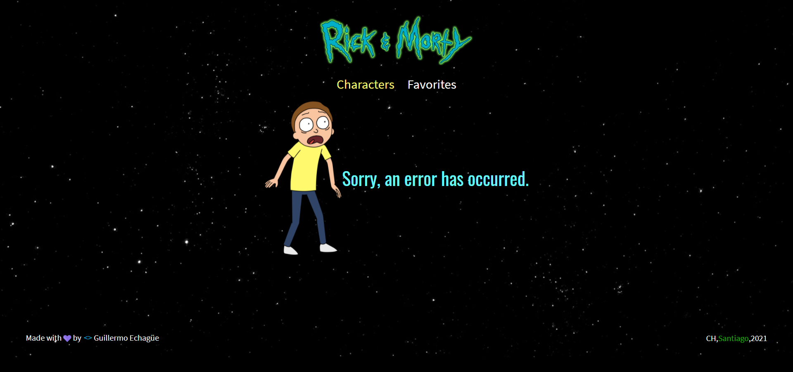
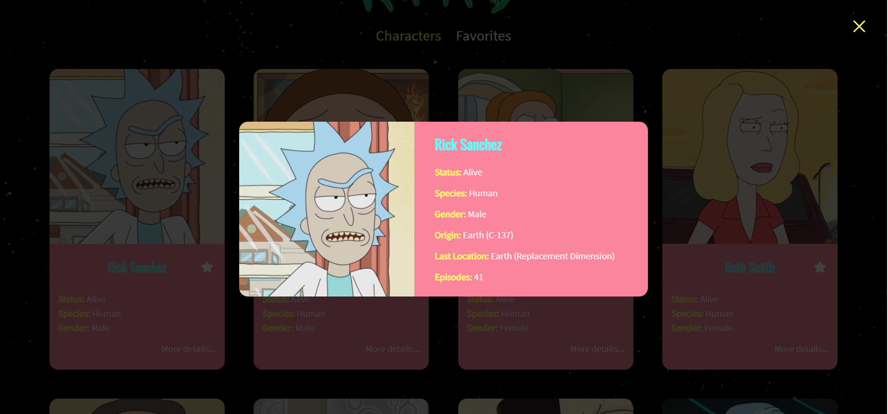
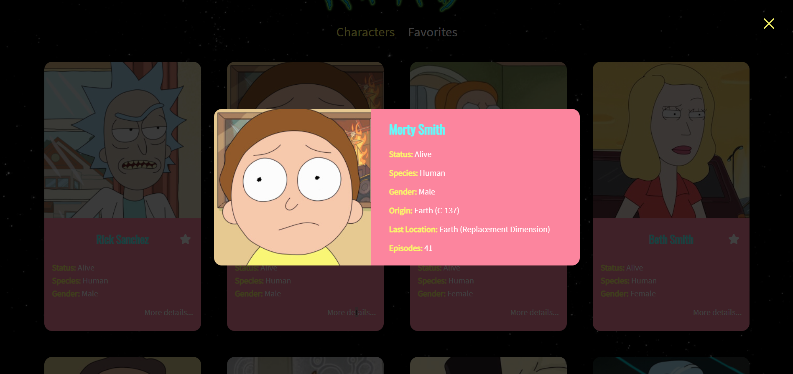
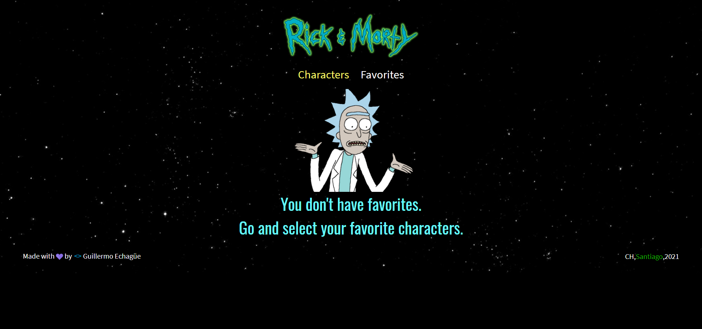
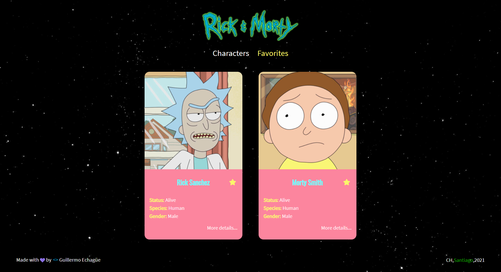

 webpack configuration and deploy vercel finished
 good practices with code splitting, webpack configuration and babel
 page favorites completed + custom hooks


# Getting Started with Create React App

This project was bootstrapped with [Create React App](https://github.com/facebook/create-react-app).


## Dependencias del proyecto

```bash
# Axios
yarn add axios
# node-sass
yarn add node-sass@4.13.0
# prop-types
yarn add prop-types
# react-router-dom
yarn add react-router-dom
# redux
yarn add redux@4.0.4
# react-redux
yarn add react-redux
# redux-devtools-extension
yarn add redux-devtools-extension
# redux-logger
yarn add redux-logger
```
## Dependencias en producción del proyecto (Code Splitting)
```bash

```

## Proyecto en producción en Versel

```bash

```

## Codigos GIT
```bash
# Revisar logs
git log --pretty=oneline
#Cargar cambios y versiones
git branch -M main
git push -u origin main
# Generar Tags
           (Version) 
git tag -a V1.0.0 -m "Mensaje"
git push --tags
#branches (Ramas)
git add .
git checkout -b room
git commit -m "Agregado de dependencias"
git push origin room
#Unir Ramas a main
git checkout main
git merge <Nombre Rama> -m "Mensaje rama"
```


## Demostración del proyecto

### Error


### Character


### Detail



### Favorites


